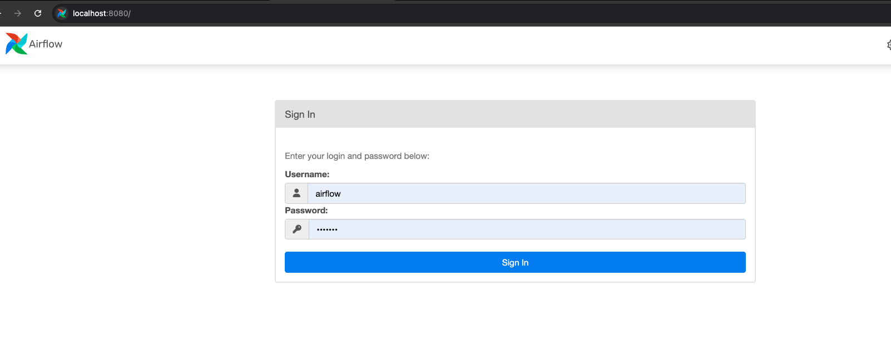

# XKCD Comics Pipeline  
This project is a data pipeline that extracts and transforms data from [XKCD](https://xkcd.com/) web comics. It aims to build a data platform that supports decision-making through efficient ingestion, processing, and modeling of data using Airflow, PostgreSQL, and dbt.

### Architecture


## Features

- Scheduled DAG (Mon/Wed/Fri) with a polling mechanism. We use a Sensor to check for new comics and load them into the database as soon as they become available.
- Extracts comic metadata from the [XKCD API](https://xkcd.com/json.html).
- Loads raw data into PostgreSQL.
- Transforms data using dbt.
- Applies data quality checks.
- Loads transformed data into PostgreSQL.


---

##  Setup Instructions

#### 1. Clone this repository

```bash
git clone https://github.com/csuwaki/xkcd-pipeline.git
cd dags
```

#### 2. Setup the environment with Docker

```bash
docker compose up
```

This will start the required containers, including:
- **Airflow Webserver & Scheduler**: handles orchestration and DAG execution.
- **Airflow Metadata Database**: stores DAG runs, task status, logs, etc.
- **XKCD Postgres Database**: the custom database used to store and query comic data.
- **dbt**: The dbt is pre-installed in the Airflow container through the custom Docker image built from the provided Dockerfile. This means you can run dbt transformations directly within the Airflow environment.


#### 3. Access the Airflow UI
Once the services are up and running, you can access the Airflow web interface at: http://localhost:8080  

Username: airflow  
Password: airflow



#### 4. Access the DAG


####  5. Access to the Database:

After the pipeline is executed, the transformed data will be available in the custom PostgreSQL database.

You can connect using any PostgreSQL client (e.g., DBeaver) with the following credentials: 


Host: localhost  
Port: 5434  
Database: xkcd  
Username: admin  
Password: admin  


#### 6. Data Modeling 
This project uses a dimensional model to organize the data into facts and dimensions, making it easy to query and analyze.


#### 7. Explore
Once connected, you will be able to explore both raw and transformed tables.

